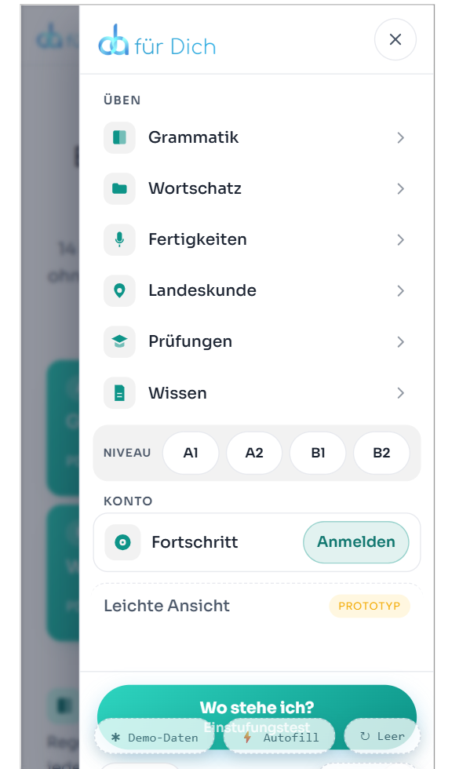

# Nav-CTA: „Kostenlos üben" → nächster Schritt (v1, 2026-09-23)

Built from `NAV-CTA-PROMPT.md`. The nav's primary button used to be „Kostenlos üben" →
`/uebungen`. It now shows one next step, picked from what this browser already knows.

| State | Label (de) | Second line | Target |
| --- | --- | --- | --- |
| A · resume | Weiter üben | topic title, e.g. „Dativ" | `last.path` from `getResume()`, or the next entry in `recents` if `last` is the current page |
| B · level | Mit A2 starten | — | `/uebungen/grammatik#niveau-a2` |
| C · placement | Wo stehe ich? | Einstufungstest | `/einstufungstest` |
| C on `/einstufungstest` | Zu den Übungen | — | `/uebungen` |

## Files

- `src/lib/nextStep.js`: `getNextStep(path)` and `fallbackStep(path)`. It reads `da_progress_v1` through
  `getResume()` and `da-einstufung`. Every read is in try/catch, it writes nothing, and it
  adds no new storage keys.
- `src/components/NextStepCta.astro`: the button (`variant="header" | "drawer"`). The server
  renders state C. The script upgrades to A or B, puts `data-i18n` and `data-i18n-vars` on
  the label before it translates, and re-translates on every language change. It also marks
  the placement level's chip in the drawer's NIVEAU row (`.is-mine`, a dot, `aria-current="true"`).
- `SiteNav.astro` and `NavDrawer.astro` render `<NextStepCta>` where the old link was.
- `site-nav.css` covers:
  - the two-line drawer layout, where the second line is muted and truncated
  - `min-width: 9.75em` on the header button, so the upgrade doesn't move the header
  - the "dein Niveau" dot
  - `.lp-next.lp-btn--primary { color: #fff }`. The landing page's `.lp a { color: inherit }`
    was turning the label dark on the teal pill (the old CTA had the same bug).
- `demo-dock.css`: the demo dock hides while the drawer is open, because it covered this button.
- i18n: added `nav.next.resume`, `nav.next.level` (`{level}`), `nav.next.placement`,
  `nav.next.placementSub` and `nav.next.toExercises` to all five locales. `nav.cta` is left in
  place for the prototypes. `scripts/validate-i18n.mjs` passes: 1388 keys × 5 locales, placeholders match.

## Verified (dev server, Chrome)

- **C:** cleared storage on `/wissen` renders „Wo stehe ich? · Einstufungstest" → `/einstufungstest`.
  It is also the server HTML, so it works with JS off or storage blocked.
- **B:** with `da-einstufung = A2`, the button reads „Mit A2 starten" →
  `/uebungen/grammatik#niveau-a2`, and the drawer's A2 chip has `aria-current="true"`.
- **A:** after one answer on `/uebungen/grammatik/artikel` (with Dativ practised before), the
  button on `/` reads „Weiter üben · Artikel: der, die, das" with the accessible name
  „Weiter üben: Artikel: der, die, das". On the Artikel page itself it points to Dativ, not to itself.
- **Language switch:** tested de → en → ar → tr → uk → de in state A, and ar ↔ de in state B.
  The label and accessible name follow every time.
- **Width:** the header button measured 136 px in state A, which is the reserved minimum,
  so the German labels don't shift the header.

The demo dock covers the lower half of the button in this screenshot. That's fixed now:
the dock hides while the drawer is open.

## Open

- **Screenshots of states A and B:** not taken. The browser tab was closed during the
  screenshot pass. Both states were checked through the DOM (above).
- **Longer labels in other languages** („Який у мене рівень?", „Çalışmaya devam et") are
  wider than the reserved 9.75em. The header can still shift a little on upgrade in those
  languages. The header button is hidden at ≤430px and between 1081 and 1359px anyway.
- **`pnpm build`:** see the run below. The Vercel adapter's final symlink step fails on this
  Windows machine (EPERM), independent of this change.
